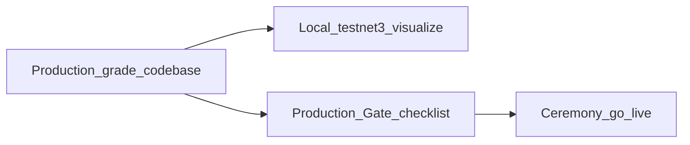

# Plano: Rede de Vaults (Mesh) + Kerosene Banco

Documento de discussão e baseline de implementação da nova infraestrutura de cofre/governança.

Kerosene **permanece banco** (ledger de saldos, regras, produto). A mesh de vaults Rust é o **cofre + plano de controle** (DKG/reshare nos vaults, atestação, releases, FROST `2/3`, settlement).

Status: rascunho de arquitetura consolidado após discussão.  
Billing de máquinas (compra/colo vs provedor crypto) = **adiado** (pago por fora).

### Princípio: produção no código, lab na visualização

A implementação nasce com **contratos, hygiene e fail-closed de produção**. O lab local / testnet3 só **visualiza e exercita** o mesmo binário com flags/features de lab (`MODE=lab-visualize`) — **não** é um fork “toy” que depois se reescreve.

| Ambiente | O que roda | O que é proibido |
| --- | --- | --- |
| **Local / lab / testnet3** | Mesmo código; `dealer_lab` + token + AEAD disk + `ATTESTATION_MODE=sim` para ver quorum/Intent/FROST | Rotular como go-live; mainnet |
| **Production build** (`--features production`) | Sem `dealer_lab` linkado; exige mTLS, DKG distributed, share seal por **tier** (TPM doméstico e/ou TEE SEV/SGX), atestação honesta ao tier | Dealer, static token, `sim` em prod, claim SEV/SGX **sem** HW, share em claro no host |

**Lab ≠ go-live.** Lab P0 exercita o caminho; o Production Gate (abaixo) é obrigatório antes de cerimônia / mainnet.

**Operadores = PCs domésticos (maioria).** A mesh **não** assume EPYC/SEV em todo nó. Segurança de produção = **threshold FROST** + **allowlist de release** + **TPM seal/identity** (doméstico) + **caps/fail-stop**. **SEV-SNP (ou SGX) é upgrade preferido**, não requisito universal. Cerimônia **nativa** fecha com set só doméstico; nós SEV, quando presentes, têm **prioridade de seating** (genesis/admissão). Detalhe: §3.1.



### Lab P0 vs Production Gate

| Critério | Lab P0 (visualização local / testnet3) | Production Gate (obrigatório go-live) | Risco se ignorado + fonte |
| --- | --- | --- | --- |
| DKG | Dealer single-process (`feature = dealer_lab` **só**); banner + production **não compila** dealer | DKG distribuído multi-round over-wire (**sem** dealer); cerimônia nativa OK em set **doméstico** | ToB 2024: threshold manipulation |
| Share protection | AEAD Argon2 + ChaCha20-Poly1305 + secrecy/zeroize | **Seal por tier:** TPM 2.0 (+ AEAD) no PC doméstico; **SEV/SGX seal** quando o nó declara TEE | Host compromise pós-unseal (pior sem TPM/TEE) |
| Auth kfe ↔ vault | `X-Vault-Token` / `VAULT_AUTH_MODE=static_token` (lab) | **mTLS mútuo** + cert rotation (SPIFFE-like); TPM pode ancorar identidade do nó | Token leak → signing |
| Attestation | Stub / measurement SHA-256 básico | **Honesta ao tier:** measured boot / TPM identity no doméstico; **HW quote** SEV/SGX só em nós TEE; + predicados / allowlist | Supply chain / binary tamper; **não** exigir quote SEV em todo nó |
| Seating / tiers | N/A (lab homogêneo) | Nós SEV/SGX com **prioridade de seating** quando presentes; set 100% doméstico **admitido** | Concentrar genesis só em VPS frágeis sem tiering |
| Rotação diária | Session material stub (epoch diário no ledger; signing bind ao day-epoch) | Rotação **completa** session + **reshare policy** | Nonce reuse em escala + stale shares |
| Anti-nonce | Determinístico + persistência local | + **replicated** anti-replay log | Key extraction (Schnorr) |
| FROST | `frost-secp256k1` 3.x | Mesma + pin de versão auditada + **concurrent-safe** sessions | Forgery (Drijvers et al.) |
| Bitcoin network | **testnet3** (`BITCOIN_NETWORK=testnet3`) | testnet3 até aceite; mainnet só Gate+flag | Fundos reais cedo demais |

Env lab (compose / props): `BITCOIN_NETWORK=testnet3`, `VAULT_API_TOKEN` → header `X-Vault-Token`, `VAULT_DATA_PASSPHRASE`, `VAULT_DATA_DIR`, `VAULT_DKG_MODE=dealer_lab`, `VAULT_AUTH_MODE=static_token`. kfe: `kfe-service-vaultmesh-testnet3.properties` + `kfe.vaultmesh.api-token`.

Gate visualize (staging mTLS): `VAULT_AUTH_MODE=mtls` + `VAULT_TLS_*`; certs via `scripts/gen_lab_mtls_certs.sh` / short-lived `scripts/rotate_lab_mtls_certs.sh`; SPIFFE-like layout in `backend/kerosene-vault/docs/MTLS_SPIFFE_LAYOUT.md`. kfe: `kfe.vaultmesh.tls.*` + HTTPS `base-url` (`kfe-service-vaultmesh-go-live.properties`); empty `api-token` under mTLS.

**Cerimônia real (Tor):** produção exige `VAULT_TRANSPORT=tor`, peers `.onion`, SOCKS (`VAULT_SOCKS_PROXY`), sem publish clearnet dos ports do vault. Lab de variabilidade Tor: `infra/docker/compose/vault-mesh-tor.compose.yaml` + `scripts/lab_dkg_wire_tor.sh`. `deploy.sh` / `ensure-vault-mesh-lab.sh` **continuam** no clearnet `vault-mesh-lab` (visualize). Detalhe: `backend/kerosene-vault/docs/CEREMONY_TOR.md`.

### Threat notes (obrigatório no threat model)

1. **Nonce reuse FROST/Schnorr (crítico)** — reuso ⇒ extração algébrica de share. Lib ZF faz binding message+participants; **nossa** orquestração ainda pode errar (reusar nonces map, resign após abort, `session_id` recycle). Controles: `session_id` único persistido; nonces zeroize pós-uso; nunca resign com mesmos nonces; preferir commit bound a `session_id || message`. Detalhe operacional em §4.3.
2. **DKG dealer / Pedersen DKG — Trail of Bits (2024)** — participante malicioso pode **aumentar o threshold silenciosamente**. Dealer single-process e DKG ingênuo são inaceitáveis em prod. Gate: DKG distribuído multi-round **com** verificações contra threshold manipulation (protocolo ZF atualizado + regressão).
3. **FROST ZF** — auditorias NCC (2023) e Least Authority (2025); sem falhas críticas graves no resumo público, mas atenção a **DKG** e **concurrent signing**. Evitar signing paralelo inseguro na mesma key sem isolamento de sessão.
4. **Disk AEAD ≪ TPM seal ≪ TEE sealing** — Argon2+ChaCha ajuda lab; TPM no PC doméstico amarra unseal à máquina/boot (ainda deixa share na RAM do host pós-unseal). SEV/SGX isola melhor a memória do vault. Prod doméstico: **TPM + threshold**; SEV = upgrade preferido, não falso equivalente ao TPM.
5. **Custody threshold** — risco dominante costuma ser **coordenação, rotação e policy**, não só crypto. Rotação diária + caps + fail-stop + governance são parte do Gate, não afterthought. Um PC doméstico comprometido ≠ cofre inteiro (precisa `≥ t` shares).

---

## 1. Objetivos

- Remover SPOF do vault atual sem só multiplicar VPS frágeis.
- Dead man: fundador sob coerção não entrega seed completa nem desliga o cofre sozinho.
- Chave da carteira principal **nunca existe completa**; só shards; vaults **não** conseguem juntar passphrase/chave.
- Shares da carteira principal ficam na **mesh de vaults desde o genesis** (DKG, nunca chave completa); **não** nos servidores Java.
- Sem migração gradual HashiCorp→mesh para tesouraria: **corte limpo** (greenfield / desliga legado de signing).
- `kfe-service` fire-and-forget: emite **Intent**, recebe **Receipt**; não guarda share FROST.
- Nó desonesto (minoria) rejeitável; maioria maliciosa precavida (caps, timelock, fail-stop, bond).
- Reward a operadores de vault (% do lucro), set ativo limitado.
- Crypto envelope/identidade preparada para PQ com rotação por época (`crypto_suite_id`).
- Código **novo** (vault Rust, ports Intent/Receipt, lab) segue **SOLID** e **Clean Architecture**, com camadas separadas de verdade.

---

## 2. Glossário de módulos (nomenclatura)

| Peça | Papel |
| --- | --- |
| **`kerosene-app`** | API, auth, produto, cola HTTP dos shards IS/CH/SG |
| **`kfe-service`** | Motor financeiro (`source.kfe`): saldos, regras, Intents, conciliação |
| **`kerosene-contracts`** | DTOs/ports estáveis (Intent, Receipt, etc.) |
| **`kerosene-shared`** | Utilitário compartilhado sem domínio KFE puro |
| **`adapters/`** | Rails externos (Bitcoin Core, Lightning, …) — sem shard FROST em claro |
| **`mpc-sidecar` (Go)** | Signer legado → **não entra no path novo**; desligar no go-live da mesh |
| **HashiCorp Vault** | Opcional só para secrets de ops **não**-tesouraria; **não** arma shares da carteira no desenho novo |
| **Vault mesh (Rust; TEE opcional)** | Detém os shares (genesis DKG), reshare, atestação, repo, cosign, FROST `2/3`; operadores em geral = **PCs domésticos** (+ nós SEV preferidos) |

Quando este doc diz “banco”, lê-se sobretudo **`kfe-service`** (+ app/contracts). Não confundir com “servidor completo”.

---

## 2.1 Código novo: SOLID + Clean Architecture (obrigatório)

Todo código **novo** deste plano (`kerosene-vault` Rust, contratos Intent/Receipt, adapters de mesh no `kfe-service`, lab harness) deve nascer com **SOLID** e **Clean Architecture**. Não empilhar protocolo, crypto, Tor e HTTP no mesmo arquivo/módulo.

### SOLID (aplicação prática)

| Princípio | Regra neste projeto |
| --- | --- |
| **S** Single Responsibility | Um módulo = uma razão de mudar (ex.: FROST ≠ gossip Tor ≠ allowlist de release) |
| **O** Open/Closed | Novas suites crypto / predicados via extensão (strategy/port), sem reescrever o núcleo de época |
| **L** Liskov | Adapters (sim / TPM doméstico / SEV/SGX, Tor real vs lab) substituíveis sem quebrar use cases |
| **I** Interface Segregation | Ports finos (`SignIntent`, `PutBlob`, `CosignRelease`) — sem “God trait” de vault |
| **D** Dependency Inversion | Domínio/use cases dependem de **traits/ports**; Tor, TEE, disk, gRPC são **adapters** |

### Clean Architecture — camadas (vault Rust)

Dependências só **para dentro** (outer → inner). Inner **não** importa Tor, gRPC, RocksDB, libs de rede.

```
┌─────────────────────────────────────────────────────────┐
│  Interface adapters                                      │
│  tor / mTLS / rpc · TEE quote · blob store · metrics     │
├─────────────────────────────────────────────────────────┤
│  Application (use cases)                                 │
│  DkgGenesis · FrostSignIntent · CosignRelease · Reshare  │
│  AdvanceEpoch · EnforceCaps · AntiNonceSession           │
├─────────────────────────────────────────────────────────┤
│  Domain                                                  │
│  Epoch · Constitution · ShareId · Intent · Receipt       │
│  Allowlist · SigningSession · Policy (regras puras)      │
└─────────────────────────────────────────────────────────┘
```

| Camada | Pode | Não pode |
| --- | --- | --- |
| **Domain** | Entidades, value objects, regras de constituição/caps, state machine de sessão (sem I/O) | Tor, file, clock de rede, lib FROST “suja” de socket |
| **Application** | Orquestrar use cases; chamar ports | Detalhes de transporte ou vendor TEE |
| **Adapters** | Implementar ports (frost-lib, tor, sim attestation, disk) | Conter regra de negócio de caps/época duplicada |
| **Bootstrap/main** | Wire DI, config, feature flags lab/prod | Lógica de signing |

### Clean Architecture — lado Java novo (Intent/Receipt)

- **`kerosene-contracts`:** DTOs + ports (interfaces) — sem Spring/JPA.  
- **`kfe-service` application:** use cases emitem Intent / tratam Receipt.  
- **Adapter mesh:** único lugar que fala Tor/RPC com vaults.  
- **`kerosene-app`:** só borda HTTP/auth; não conhece FROST nem nonces.

Espelhar a separação já buscada em contracts/shared/kfe — **não** regredir colando mesh no controller.

### Regras de PR / review

1. PR de vault: diff não mistura “crypto + tor + policy” sem fronteira de crate/`mod`.  
2. Testes de domínio **sem** rede (state machine nonce, caps, época).  
3. Testes de adapter com doubles (TEE sim, peer fake).  
4. `ATTESTATION_MODE=sim` / `LAB_*` só no bootstrap/adapter — nunca no domain.  
5. Proibido “utils” globais que quebram DIP (domain chamando `TorClient` estático).

### Critério de pronto (Fase 0/1)

- Diagrama de crates/mods do `kerosene-vault` alinhado às camadas acima.  
- Pelo menos um use case (`Health`/`PingPeer`) com port + adapter, para cravar o padrão antes do FROST.

---

## 3. Papéis na mesh

| Componente | Função |
| --- | --- |
| **Vaults Rust (set genesis + admitidos)** | Detêm **os shares** (1 por vault, DKG); P2P: ledger, atestação, Hs/Hb, reshare, FROST `2/3`, cosign de release |
| **Nós/servidores (`kerosene-app` / `kfe-service`)** | **Sem** share FROST; só Intent/Receipt + pull de artefatos allowlisted |
| **Ledger de vaults** | Allowlist, épocas, constituição, admissão/revogação, âncoras, elegibilidade de reward |
| **Seeds Tor** | Só discovery — **sem** superpermissão |

**Genesis:** cerimônia DKG no **conjunto** inicial de vaults (vários peers). Não há “primeiro vault” com a chave inteira nem superpermissão — cada vault genesis fica só com **seu** share; a chave completa nunca existe. Cerimônia **nativa** é suportada com set só doméstico; ver §3.1 para prioridade SEV.

Não há vault primário em runtime. Líder de rodada FROST, se existir, é **rotativo** e sem poder extra de chave.

### 3.1 Tiers de nó: doméstico vs SEV (modelo fechado)

A maioria dos operadores de vault são **computadores domésticos** (ex. Ryzen desktop) **sem** SEV-SNP. Isso é **first-class**, não exceção.

| Tier | Hardware típico | Papel |
| --- | --- | --- |
| **`domestic`** | PC / mini-PC com **TPM 2.0** (fTPM ou dTPM); sem enclave SEV/SGX | Maioria do set; cerimônia nativa e signing quorum |
| **`sev` / `sgx`** | Host com SEV-SNP (EPYC/colo) ou SGX | **Upgrade preferido**; prioridade de seating quando presente |

**Baseline de segurança (não é “todo nó = HW TEE”):**

1. Threshold FROST `2/3` (um host doméstico comprometido ≠ chave completa).  
2. Allowlist de release + rebuild + predicados (binário mentiroso fora do set).  
3. **TPM 2.0:** selar material de disco / identidade do nó / measured boot onde disponível.  
4. Caps, timelock, fail-stop, anti-nonce, governance.  
5. **SEV-SNP (ou SGX):** preferido quando o operador puder — melhor isolamento de memória + quote — **não** requisito universal de Gate.

**Cerimônia nativa**

- Fecha com `n` nós **todos domésticos** (ex. genesis `n=3`).  
- Se houver candidatos SEV/SGX no roster, eles têm **prioridade de seating** (preencher assentos genesis / waiting→active antes de domésticos equivalentes).  
- Gate **recusa** claim falso (`ATTESTATION_MODE=sev|sgx` sem HW / stub em prod). Gate **não** recusa set só-doméstico honesto.  
- `--features production` alinha com isso: proíbe dealer/`sim`/stub; **não** exige SEV em 100% dos nós.

#### Seating algorithm (implementado)

1. Candidatos = nó local (`VAULT_NODE_TIER`) + `VAULT_SEED_PEERS` com tiers de `VAULT_PEER_TIERS` (default `domestic`).  
2. Ordenar por prioridade **sev (3) > sgx (2) > domestic (1)**; empate por `node_id` ascendente.  
3. Tomar os primeiros `VAULT_GENESIS_N` / `signing_n` assentos (`seat_genesis_by_tier`).  
4. Health: `GET /v1/health` expõe `node_tier`, `attestation_mode`, `tee_available` (nunca rotular TPM como SEV).

#### Env (produção doméstica / mista)

| Var | Domestic native | TEE preferido |
| --- | --- | --- |
| `VAULT_NODE_TIER` | `domestic` (ou `auto` → sem `/dev/sev-guest`) | `sev` / `sgx` só com HW |
| `ATTESTATION_MODE` | `software` | `sev` / `sgx` |
| `VAULT_SHARE_STORE` | `aead_disk` (+ TPM seal opcional) | `tee_seal` |
| `VAULT_SHARE_TPM_SEAL` | `1` para selar passphrase AEAD no TPM (off default); stub lab `VAULT_SHARE_TPM_STUB`; clear fallback só lab `VAULT_SHARE_TPM_CLEAR_FALLBACK` | n/a (TEE usa `tee_seal`) |
| `VAULT_DKG_MODE` | `distributed_wire` (mesmo path do lab) | idem |
| `VAULT_PEER_TIERS` | opcional | `vault-epyc=sev,...` para preferência de assento |
| `ATTESTATION_STAGING_STUB` | off | **proibido** em produção |

Runbook curto: `backend/kerosene-vault/docs/CEREMONY_NATIVE.md`. Checklist: `./scripts/genesis_ceremony_checklist.sh`.

#### TPM 2.0 vs SEV-SNP (tabela honesta)

| Capacidade | TPM 2.0 (PC doméstico) | SEV-SNP (servidor confidencial) |
| --- | --- | --- |
| Selar chave / share em disco à máquina | **Sim** (seal a PCR/chave TPM) | **Sim** (derived key / enclave seal) |
| Measured boot / recusar unseal se boot trocou | **Parcial/sim** via PCR | **Sim** (measurement no report) |
| Identidade do nó para mTLS / “sou o vault X” | **Sim** (chave no TPM) | **Sim** (quote + identidade de plataforma) |
| Isolar share da RAM do Linux/root pós-unseal | **Não** — share fica na RAM do host | **Sim** (memória de guest confidencial) |
| Impedir hypervisor/OS host de ler memória do vault | **Não** | **Sim** (modelo SEV) |
| Attestation remota do binário vault com quote de chip | **Limitado** (TPM quote ≠ enclave app) | **Sim** (SNP attestation report) |
| Anti-roubo de SSD sem o host | **Bom** | **Bom** |
| Disponibilidade em miner/home PC | **Comum** | **Rara** (EPYC/colo; não Ryzen 5500 típico) |

**Frase curta:** TPM reforça o nó doméstico; **não** substitui SEV. A rede depende do **quorum + policy**, não de todo operador ter EPYC.

---

## 4. Modelo de chave e provisionamento (regra de ouro)

### 4.1 O que é proibido

- Existir passphrase/seed/chave privada **completa** em qualquer lugar (Vault, app, disco, RAM de um processo).
- Vault (ou mesh) ver **≥ t shares em claro** ou remontar a chave “para ajudar”.
- Entregar ao servidor Java a chave inteira ou todos os shares.

### 4.2 Onde ficam os shares (decisão)

Os shares da carteira principal (e buckets FROST) **ficam nos vaults da mesh**, desde o **genesis**:

1. **DKG sem dealer** no conjunto genesis — chave completa nunca é calculada.  
2. Cada vault guarda **somente o seu** share em store selado ao tier (`TPM`/AEAD no doméstico; **TEE seal** em SEV/SGX); os outros vaults **não** recebem plaintext desse share.  
3. Vaults **não** conseguem juntar e formar passphrase/chave (precisariam de `≥ t` shares em claro no mesmo lugar — proibido pelo protocolo).  
4. **Servidores Java não são armados com shares FROST** (diferente do fluxo HashiCorp→servidor atual).  
5. O que a mesh “prover” ao `kfe-service` = **pubkey/descriptor**, status de época, e **assinatura sob Intent** — não o share.  
6. **Reshare** por época / admissão / eject: novos shares nos vaults; endereço de grupo pode permanecer.  
7. **Uso único** = material de **sessão de assinatura**, não nova master a cada depósito.

**HashiCorp / mpc-sidecar:** sem cutover gradual de tesouraria. Path novo sobe; signing legado **não** coexiste como plano — desliga quando a mesh genesis estiver atestada e o DKG feito.

### 4.3 Prevenção de reutilização de nonce (Schnorr / FROST) — obrigatório

Em Schnorr/FROST, **reusar o mesmo nonce** em duas assinaturas (ou duas sessões) com a mesma chave/share permite **extrair algebricamente a fração da chave** daquele cofre. Isso é **catastrófico** e deve ser tratado como requisito de segurança de Fase 3, não como detalhe de implementação.

**Estado até esta nota:** o plano citava FROST, mas **não** explicitava anti-nonce-reuse. Passa a ser requisito.

#### Controles obrigatórios (enclave / lib FROST)

1. **Um nonce (ou par de nonces FROST) por `signing_session_id`**, nunca reutilizado.  
2. **Geração preferencial determinística e ligada à sessão** (padrão das libs FROST sérias / binding ao message + session + share), de forma que RNG fraco ou crash no meio **não** reutilize o mesmo estado “aleatório” em outra mensagem.  
   - Alternativa aceitável: CSPRNG do TEE **mais** contador monotônico + transcript da sessão, com abort se colisão.  
3. **Commit–then–reveal** do protocolo FROST: commitments de nonce amarrados ao transcript; mudar a mensagem depois do commit ⇒ **abort** da sessão (não resign com o mesmo commitment).  
4. **Estado de sessão em TEE:** após `sign` completo ou abort, **zeroize** nonces; sessão marcada `consumed`; replay do mesmo `signing_session_id` ⇒ reject.  
5. **Dedup / anti-replay no ledger ou store local:** rejeitar segundo Intent/sessão que reutilize commitment de nonce já visto (mesmo vault).  
6. **Proibido:** API que aceite “nonce escolhido pelo host”, logar nonce, persistir nonce em disco fora do enclave, ou retomar sessão mid-sign sem transcript idêntico.  
7. **Lib:** apenas implementação FROST auditada (ex. frostr / secp256kex threshold stack escolhida na F3); **proibido** “Schnorr caseiro”.  
8. **Testes de regressão / pentest lab:**  
   - forçar duas assinaturas com mesmo nonce commitment ⇒ deve falhar ou, em harness de teste controlado, demonstrar que a lib **não** permite o caminho;  
   - crash entre commit e reveal ⇒ restart **não** reusa nonce; nova sessão.  
9. **Detecção operacional:** métrica/alerta `nonce_commitment_reuse_attempt`; tratar como incidente (possível eject/slash do nó se for comportamento repetido suspeito).

#### Anti-nonce replicado (quorum) — Gate

Substitui gossip best-effort / volume compartilhado. Log append-only de `session_id` com ACK de quorum entre peers da mesh:

1. **Persistência local:** `used_sessions.log` (append + `fsync`) — sobrevive restart; segundo claim local ⇒ `NonceReuse`.
2. **Prepare remoto:** `POST /v1/anti-nonce/prepare` (auth: `X-Vault-Token` em lab; sem token header quando `VAULT_AUTH_MODE=mtls`). Peer faz check-and-insert durável e responde `{already_seen: bool}`.
3. **Claim / sign:**
   - burn local primeiro;
   - collect prepares nos `VAULT_SEED_PEERS`;
   - **recusa** se **qualquer** peer honesto reportar `already_seen` (≥1);
   - **recusa** se `have < ceil(2n/3)` (`QuorumNotMet`) — não assina antes do commit de quorum;
   - só então libera a sessão de signing.
4. **Fail-closed:** peer offline não conta no quorum; sessão queimada localmente sem quorum não é reutilizável neste nó.
5. Implementação: `QuorumAntiNonce` + `HttpAntiNonceTransport` (`kerosene-vault`); testes multi-nó em memória em `session_persist`.

#### O que isso NÃO resolve sozinho

- Bug na lib FROST ou host que force o enclave a assinar fora do state machine.  
- Por isso: measurement allowlisted + predicados + rebuild + seal por tier (TPM e/ou TEE).

#### Critério de pronto (Fase 3)

Além de “assina com 2/3”: **suite anti-nonce-reuse verde**; code review da state machine de sessão; zeroize verificado.

### 4.4 Buckets de tesouraria

Separar lastro de cliente de dinheiro operacional:

```
USERS (FROST)     ← depósitos dos usuários; saques só Intent+caps
       │ lucro/fees contabilizados no kfe-service
       ▼
PROFIT (FROST / policy)
       ├── MINERS    ← p% do lucro (atestação)
       ├── CHANNELS  ← liquidez / rebalance LN
       └── INFRA     ← custo servidores/colo (ops multiparty)
```

- Miners/canais/infra **não** debitam omnibus USERS direto.  
- Percentuais na constituição/época (`split_miners`, `split_channels`, `split_infra` + `p_reward_max`).  
- Cada bucket: allowlist de destinos e caps próprios no enclave.

---

## 5. Comunicação

```
Vault ◄──Tor/P2P──► Vault     gossip, FROST, get/put Hs|Hb, attest, reshare
       ▲
       │ Intent / Receipt / epoch artifacts
       ▼
kfe-service (+ kerosene-app na borda)
```

| De → Para | Mensagens |
| --- | --- |
| Vault → Vault | peers, FROST, blobs, votes/cosign, reshare |
| `kfe-service` → mesh | `Intent`, fetch allowlist/artefatos |
| Mesh → `kfe-service` | `Receipt`, `Reject`, fail-stop, status |

Transporte: Tor + mTLS / sessão com suite crypto da época.  
Control plane dos servidores preferencialmente **só via mesh**.

---

## 6. Baseline numérico (v1)

| Parâmetro | Valor |
| --- | --- |
| Settlement / signing | **`t = ⌈2n/3⌉`** (quorum **2/3**). Ex.: n=3 → **2-de-3**; n=7 → **5-de-7** |
| Governance pesada | **`≥ t_sign + 1` ou `n−1`** + timelock (mais duro que assinar tx) |
| Set ativo de vaults | **n fixo** (ex. 3 geo IS/CH/SG ou 7 na mesh) + ≥2 spares / waiting |
| Pool miners | **1%** do lucro apurado (early); `p_reward_max` ex. **5–8%** |
| Waiting set | não dilui pool (ou fração mínima) |
| Timelock NORMAL | **14 dias** |
| Timelock EMERGENCY | **48 horas** |
| Timelock CONSTITUTIONAL | **≥ 30 dias** |
| Bond (fase aberta) | **≥ 9×** payout mensal esperado |
| Slash grave | **100%** + ban |
| Cap saque USERS | **≤ 1% TVL/dia** (início) |
| Diversidade | meta ≤ 1 nó ativo / provedor |

Elegibilidade reward: atestação diária + uptime (ex. 95%/30d) + streak; payout crypto via **Intent** do `kfe-service` a partir do bucket MINERS — vaults **não** se auto-pagam.

**Governance job bounty (mesh):** após quorum de `day_advanced` / `reshare_completed` (e no path de release cosign/activate), a economy acruja bounty aos operadores elegíveis que participaram (voto/reshare/cosign). Config: `VAULT_GOVERNANCE_REWARD_SATS` e/ou `VAULT_GOVERNANCE_REWARD_BPS` (bps do pool atual). Ledger emite `governance_reward_accrued`; `/economy/status` expõe `pending_governance_reward_sats`. Payout continua bank-issued (MINERS Intent) — aqui só accrual + elegibilidade.

Fase 1 permissioned (reward 0/simbólico) → fase 2 abre p% de verdade.

**Assinatura de transação:** quorum **2/3** dos **vaults** detentores de share do bucket (`t = ⌈2n/3⌉`). Fail-stop se online &lt; `t`.

**Go-live:** sem implementação gradual HashiCorp→mesh para a carteira. Genesis DKG na mesh → Intents apontam só para a mesh → desligar mpc-sidecar/path antigo de signing.

---

## 7. Constituição e paths de mudança

Constituição no **ledger** (não em dependência de app): caps, `min_t`/`min_n`, `p_reward_max`, splits PROFIT, timelocks, `crypto_suite_id`, regras de cosign.

| Path | Quem | O que pode |
| --- | --- | --- |
| **NORMAL** | Council release `2/3` + cosign vaults `⌈n/2⌉`+ + rebuild ≥3 + 14d | Código; **mesma** constituição |
| **EMERGENCY** | Council mais duro + 48h | Patch; caps **≤** atuais |
| **CONSTITUTIONAL** | Threshold/delay maiores | Único que **afrouxa** poder / sobe caps / muda splits críticos |

Parâmetro econômico ≠ binário. Cosign de vault = **predicados no enclave**, não voto humano anti-taxa.

Predicados NORMAL (resumo):  
`personal≥2/3` ∧ `age≥14d` ∧ `hash_ok` ∧ `reproducible_match≥3` ∧ `constitution_hash==active` ∧ `caps_not_increased` ∧ `threshold_not_weakened` ∧ `epoch_ok` ∧ `not_replay`

---

## 8. Keys de ops (separação)

| Função | Keys |
| --- | --- |
| **Release** | Council pessoal `2/3` (split geo/humano) + cosign automático vaults |
| **Audit / logs** | Council **separado** (≠ release) |
| **Settlement shares** | Só enclaves detentores; nunca keys de ops humanas |

---

## 9. Releases (receber e ativar)

1. Dev/CI publica `Hs` (fonte+lock) + `Hb` (binário) + sigs pessoais.  
2. Proposta no ledger → timelock.  
3. Vaults `get(Hs/Hb)`, **rebuild independente ≥3**, predicados → cosign.  
4. Allowlist da época.  
5. Vaults migram → **depois** `kerosene-app` / `kfe-service` puxam `Hb` allowlisted da mesh.

Receber = pull verificado da mesh, não push SSH do fundador.

---

## 10. Settlement (banco)

```
kerosene-app (pedido de negócio)
    → kfe-service: debita ledger / cria Intent
    → mesh + detentores de share: policy + FROST t-of-n
    → Taproot / LN
    → Receipt → kfe-service concilia
```

Fail-stop se `online < t`.  
Saldo do usuário = ledger `kfe-service`; lastro = bucket USERS.

---

## 11. Logs

- Mesh Tor + mTLS; leitura com keys de **audit** (≠ release).  
- Redação na origem; vaults só eventos mínimos.  
- Append-only + hash chain; âncora opcional no ledger.

---

## 12. Criptografia pós-quântica e rotação

**Baseline proposto (envelope/identidade — não on-chain BTC):**

| Uso | Suite v1 |
| --- | --- |
| Troca de chave / sessão | Híbrido **ML-KEM-768 + X25519** |
| Dados | **AES-256-GCM** |
| Identidade nó / release / ledger | **ML-DSA-65** (opcional híbrido + Ed25519 no early) |
| Assinatura Bitcoin / FROST on-chain | **secp/Schnorr** até o ecossistema Bitcoin mudar |

Rotação:

- `crypto_suite_id` na constituição/época.  
- Dual-stack por N épocas → corta suite antiga.  
- Reshare de shares FROST por época (endereço de grupo pode permanecer).  
- Troca “equivalente ou mais forte” de suite ≠ path que afrouxa caps (pode ser NORMAL com predicado `suite_not_weaker`); enfraquecer = CONSTITUTIONAL.

---

## 13. Lab local: blockchain de vaults ≈ produção

Objetivo: **simular de fato o quorum** (várias imagens/VMs = vários vaults), mantendo **comunicações e fluxos de protocolo reais** — não mocks de FROST, Intent, release ou mesh.

### 13.1 O que é simulado vs real

| Camada | Lab local |
| --- | --- |
| Nós / quorum `2/3` | **Simulado em escala:** N containers **ou VMs** (ex. 3–7 + spares), cada um = um vault |
| Imagens | **Mesma imagem Rust** (tags distintas por nó ok); build reproduzível como prod |
| Tor / mTLS / suite crypto | **Real** entre peers |
| DKG, reshare, FROST, fail-stop | **Real** |
| Intent / Receipt (`kfe-service`) | **Real** |
| Ledger, allowlist, épocas, caps | **Real** |
| Release: `Hs`/`Hb`, rebuild ≥3, predicados, cosign, ativação | **Real** (atestação de **código/release**) |
| Quote TEE de hardware (SGX/SEV) | **`ATTESTATION_MODE=sim`** no lab (mesmo verificador); prod **recusa** `sim` e claim SEV sem HW |  
| Hosts TEE reais | Staging / colo opcional (`sev`/`sgx`); **não** obrigatório no lab diário **nem** em 100% dos nós de cerimônia nativa (doméstico first-class; §3.1) |

“Simular a blockchain de vaults” = **muitos nós + partições + nó mau**.  
**Não** significa fake de crypto/release: isso roda o protocolo de verdade.

### 13.2 Topologia sugerida

```
vault-mesh-lab (Compose e/ou K8s + opcional VMs)
  vault-1 … vault-n     # imagens/VMs distintas, Tor onion cada
  vault-spare-*
  kfe-service + kerosene-app
  postgres/redis
  bitcoin/lnd regtest
  NetworkPolicy / firewall entre VMs (só mesh + paths explícitos)
```

- Cada vault = processo/VM isolado (IP/onion próprio) para pentest de rede real.  
- Opcional: VMs em hypervisors diferentes / `tc` netem para latência e partição.  
- Evolução do `local-full` (hoje mpc-sidecar) → StatefulSet/serviço **vault Rust**.

### 13.3 Atestação de código e release no lab (obrigatório)

Fluxo **idêntico** ao de prod:

1. Publicar candidato `Hs` + `Hb` + sigs do council de lab.  
2. Timelock (pode ser **encurtado por config de lab**, ex. minutos — flag `LAB_TIMELOCK_SCALE`, **nunca** na imagem prod).  
3. ≥3 vaults **recompilam** e exigem `Hb' == Hb`.  
4. Cosign por predicados → allowlist → vaults migram → app/`kfe-service` puxam artefato.

Pentest: Hb adulterado, rebuild divergente, vault mentiroso, release sem `2/3` council, ativação antes do timelock.

### 13.4 Suite de testes / pentest local

- Quorum feliz: Intent → FROST `2/3` → Receipt.  
- Matar `&lt; n−t` vaults → ainda assina; matar até `&lt; t` → fail-stop.  
- Partição de rede entre VMs.  
- Vault com binary não allowlisted → fora do set.  
- Intent acima do cap → reject.  
- Release path completo (acima).  
- Replay de Intent.  
- **Nonce reuse:** tentativa de reusar commitment / sessão ⇒ reject; crash mid-sign ⇒ nova sessão sem reuso.  

Hardware-chip break (SEV quote forge) = fora do lab diário (staging TEE). Lab doméstico exercita TPM/software path sem fingir SNP.

### 13.5 Regra de higiene

- Imagem **prod** não boot com `ATTESTATION_MODE=sim` nem `LAB_TIMELOCK_SCALE`.  
- Lab pode usar council keys de teste e `p%=0`; protocolo de release/signing permanece o mesmo.  
- Compose lab (`vault-mesh-lab.compose.yaml`): `BITCOIN_NETWORK=testnet3`, `VAULT_DKG_MODE=dealer_lab`, `VAULT_AUTH_MODE=static_token`, token/passphrase **lab-only**, volumes `VAULT_DATA_DIR`. **Lab ≠ go-live.**  
- Smoke: `./backend/kerosene-vault/scripts/lab_testnet3_smoke.sh` (health + `X-Vault-Token` sign path).

---

## 14. Mitigações prioritárias

1. `n/t` + multi-provedor + prepaid (anti-apagão).  
2. Caps baixos + path constitucional separado.  
3. Rebuild ≥3 obrigatório.  
4. Keys release ≠ audit ≠ settlement; split geo/humano.  
5. Survivability do ledger `kfe-service`/DB, não só do cofre.  
6. **DKG nos vaults** (chave nunca completa; servidores sem share).

Não existe zero vulnerabilidade; erros devem ser **parada ou sangramento limitado ao cap**.

---

## 15. Gap atual → desejado (o que mudar)

| Atual | Desejado |
| --- | --- |
| HashiCorp arma servidores com material de carteira | Shares **só** na mesh vault genesis+; app sem share |
| `mpc-sidecar` Go | Desligar no go-live (sem dual-run de tesouraria) |
| App acoplado ao signer | Intent/Receipt em `kerosene-contracts` |
| Releases via registry/CI só | Allowlist + rebuild na mesh |
| Sem reward de vault | 1% lucro, n=7 ativos, elegibilidade |
| Sem buckets PROFIT explícitos | USERS / PROFIT / MINERS / CHANNELS / INFRA |

**Agora:** cravar este plano → Intent/Receipt → skeleton vault Rust → DKG genesis → lab `2/3` → go-live mesh e desligar signing legado.

---

## 16. Plano de implementação (fases)

Premissas: lab com **N imagens/VMs** desde cedo; protocolo real; `ATTESTATION_MODE=sim` só no lab; go-live **sem** dual-run de signing HashiCorp/mpc; shares só na mesh; quorum tx **2/3**.

Decisão que desbloqueia sizing: **n genesis** (recomendação de engenharia para começar: **n=3** no lab → **2-de-3**; subir para 6/7 antes de prod aberta).

```
F0 spec ──► F1 vault skeleton + lab N nós
         ──► F2 ledger + constituição
         ──► F3 DKG/FROST 2/3
         ──► F4 Intent/Receipt (contracts + kfe-service)
         ──► F5 release mesh (Hs/Hb real)
         ──► F6 buckets PROFIT + go-live lab E2E
         ──► F7 pentest + harden
         ──► F8 staging TEE + go-live prod (corta mpc)
         ──► F9 reward aberto + survivability banco
```

### Fase 0 — Spec e constituição (1–2 semanas)

**Entrega**

- Congelar `VAULT_MESH_PLAN.md` + threat model curto.  
- Escolher **n** genesis (lab e meta prod).  
- Constituição v1 (caps, `t=⌈2n/3⌉`, `crypto_suite_id`, splits PROFIT placeholders).  
- Schema mínimo: `Intent`, `Receipt`, `Epoch`, `AllowlistEntry` em `kerosene-contracts` (stubs).  
- **Layout Clean Architecture** do crate `kerosene-vault` (domain / application / adapters) + ports iniciais.

**Critério de pronto:** n definido; contratos compilam; doc aprovado; **esqueleto de camadas** revisado (SOLID/CA).

### Fase 1 — Vault Rust skeleton + lab multi-nó (2–4 semanas)

**Entrega**

- Crate/binário `kerosene-vault` (Rust): identity, health, Tor (ou stub Tor→real), peer gossip — **camadas CA §2.1**.  
- `ATTESTATION_MODE=sim` + refuse-sim em build prod (**só adapter/bootstrap**).  
- Compose/K8s/`vault-mesh-lab`: **N containers ou VMs** (mesmo código, onions/IPs distintos).  
- NetworkPolicy / firewall entre nós.

**Critério de pronto:** N vaults se descobrem e ping autenticado; matar 1 nó não derruba os outros; **domain testável sem rede**.

### Fase 2 — Ledger de governança (2–3 semanas)

**Entrega**

- Log/ledger permissioned entre vaults (épocas, propostas, votos).  
- Constituição ativa no ledger; fail-closed se divergir.  
- Seeds de bootstrap documentados.

**Critério de pronto:** época avança com quorum de governance; nó fora do set não escreve estado.

### Fase 3 — DKG + FROST `2/3` + fail-stop (3–5 semanas)

**Entrega**

- DKG genesis (chave nunca completa; 1 share / vault).  
- Reshare (admissão/eject/rotação).  
- Assinatura threshold `t=⌈2n/3⌉` (regtest/Taproot ou msg de teste).  
- Fail-stop se online &lt; t.  
- Buckets lógicos USERS (mínimo) no policy do enclave/vault.

- Critério de pronto: lab com N VMs assina com 2/3; com &lt;t online não assina; **suite anti-nonce-reuse verde**; nenhum vault exporta chave completa.

### Fase 4 — Integração banco: Intent / Receipt (2–4 semanas)

**Status (lab):** ports em `kerosene-contracts`; client HTTP `KfeVaultMeshSettlementClient` + fallback `MESH_DISABLED` (`KfeVaultMeshConfiguration`); endpoint interno `POST /internal/kfe/vault-mesh/intent`; flags `kfe.vaultmesh.*` (default off). Rails/mpc intactos. Hook opt-in no submit outbound via `KfeVaultMeshIntentService` (`submit-on-outbound`).

**Status (lab — day rotation orchestration):** kfe **requests** daily day-advance + reshare; vaults **execute**. Worker `KfeVaultMeshDayRotationWorker` (`kfe.vaultmesh.day-rotation.*`) polls GET `/v1/day/current`; if mesh day &lt; UTC today → POST `/v1/day/vote` + `/v1/day/advance` + `/v1/reshare/trigger`. Idempotent same-day no-op. Auth = existing vaultmesh token / mTLS. Vaults do not self-cron the calendar day. mpc stays off on mesh-only path.

**Status (lab / testnet3 — PSBT on-chain):** mesh-only outbound builds funded PSBT via Bitcoin Core (`includeWatching`, `change_type=bech32m`) → vault `POST /v1/bitcoin/sign-psbt` (Intent gate + `frost-secp256k1-tr` Taproot key-path sighashes) → finalize/broadcast. Deposit: `GET /v1/bitcoin/deposit` (`tr()` + `tb1p…`). mpc-sidecar permanece off.

**Entrega**

- Ports em `kerosene-contracts`; client na mesh a partir de `kfe-service`.  
- `kerosene-app` só dispara negócio → `kfe-service` emite Intent.  
- Caps enforced na mesh; Receipt reconcilia ledger.  
- **Não** ligar ainda mpc-sidecar ao path novo (path antigo intacto até F8).

**Critério de pronto:** fluxo E2E lab: crédito interno → Intent saque regtest → Receipt → saldo coerente.

### Fase 5 — Release mesh real (3–4 semanas)

**Status (lab):** content-addressed `Hs`/`Hb` blob store; council quorum `⌈2n/3⌉`; rebuild independente ≥3; predicados + cosign vaults `⌈n/2⌉+`; allowlist; `LAB_TIMELOCK_SCALE` (default `0` = imediato no lab). Tamper de `Hb` falha no rebuild. HTTP: `/release/*`.

**Entrega**

- Repo content-addressed `Hs`/`Hb` entre vaults.  
- Council keys de lab; predicados; rebuild ≥3; cosign; allowlist.  
- `LAB_TIMELOCK_SCALE` só lab.  
- App/`kfe-service` só sobem artefato allowlisted.

**Critério de pronto:** release adulterado rejeitado; release limpo ativa N vaults + app no lab.

### Fase 6 — Buckets PROFIT + E2E lab “produção simulada” (2–3 semanas)

**Status (lab):** buckets USERS/PROFIT/MINERS/CHANNELS/INFRA com caps + allowlist de destino; splits PROFIT dry-run (`miners_bps=0`); gate de Intent (cap/replay); suite `tests/lab_e2e_suite.rs` + `scripts/lab_e2e.sh` (§13.4). Compose com `LAB_TIMELOCK_SCALE=0`.

**Entrega**

- Policies USERS / PROFIT / MINERS / CHANNELS / INFRA (payout miners pode ser dry-run/`p%=0`).  
- Suite automatizada §13.4 (partição, nó mau, cap, release, fail-stop).  
- Documentação runbook lab (subir N VMs, genesis, intent smoke).

**Critério de pronto:** um comando/script sobe lab completo; suite verde.

**Runbook rápido**

```bash
# Suite §13.4
cd backend/kerosene-vault && ./scripts/lab_e2e.sh

# Mesh 3 nós (Docker)
docker compose -f infra/docker/compose/vault-mesh-lab.compose.yaml up --build
# Intent gate smoke: POST /intent/gate/{id}/USERS/bc1q-users-withdraw/1000
# Profit dry-run:   POST /profit/allocate/1000000
```

### Fase 7 — Pentest e hardening (2–3 semanas)

**Status (lab):** hygiene §13.5 (`hardened` / `KEROSENE_ENV=production` / `--features production`) recusa `ATTESTATION_MODE=sim` e `LAB_TIMELOCK_SCALE`; endpoints lab (`propose-tampered`) off; Intent sanidade (tamanho, path traversal); harness `tests/pentest_harness.rs` + `scripts/lab_pentest.sh`.

**Entrega**

- Pentest interno/externo no lab (rede, quorum, release, Intent abusivo).  
- Correções de predicados/caps; fuzz mensagens.  
- Travar flags perigosas fora do lab.

**Critério de pronto:** achados críticos fechados ou aceitos por escrito no threat model.

**Threat model — residual aceito (lab, pré-F8)**

| Achado | Severidade | Tratamento |
| --- | --- | --- |
| Fingerprint / FROST lab placeholders (não SHA-256/secp real) | Alta em prod | Aceito no lab; **obrigatório** vender crypto real antes de F8 go-live |
| HTTP std-only sem mTLS/Tor | Alta em prod | Aceito no lab; F8+ transporte hardened |
| `propose-tampered` disponível só com `hardened=false` | Baixa | Mitigado: 403 fora do lab |
| Cap/replay/council/rebuild predicados | — | Cobertos pelo harness F7 + suite F6 |

```bash
cd backend/kerosene-vault && ./scripts/lab_pentest.sh
```

### Fase 8 — Staging TEE + go-live prod (corte limpo) (3–6 semanas)

**Status (staging scaffold):** adapters TEE `sev|sgx` (`TeeAttestationAdapter`) com stub de staging (`ATTESTATION_STAGING_STUB`); produção ceremonial **recusa** stub e claim SEV sem HW; compose `vault-mesh-staging.compose.yaml` (**mTLS default** + cert gen/rotate) — staging TEE **não** implica que todo nó de prod seja SEV; checklist `scripts/genesis_ceremony_checklist.sh`; kfe `mesh-only` + `kfe.mpc.signing-enabled=false` + `KfeVaultMeshGoLiveGuard` + client TLS `kfe.vaultmesh.tls.*`. Cerimônia **nativa** com set doméstico (TPM) é Gate-válida; SEV nodes = prioridade de seating (§3.1).

**Entrega**

- Cerimônia nativa com set **doméstico** e/ou misto; nós `ATTESTATION_MODE=sev|sgx` quando HW real existir (upgrade preferido, não cota 100%).  
- Genesis DKG de **produção** (cerimônia).  
- Wire `kfe-service` → **somente** mesh.  
- **Desligar** mpc-sidecar / armamento HashiCorp de carteira (sem dual-run).  
- Monitoramento/audit keys separadas.  
- Policy de seating: SEV/SGX antes de doméstico equivalente quando ambos candidatarem.

**Critério de pronto:** saque real testnet/mainnet conforme política; legado de signing off; rollback = só fail-stop + runbook (não “voltar mpc” silencioso).

**Cutover (limpo)**

```bash
# Staging TEE stub mesh (optional SEV path)
docker compose -f infra/docker/compose/vault-mesh-staging.compose.yaml up --build

# Ceremony gate — domestic-native (Ryzen / home PC)
VAULT_CEREMONY_MODE=production VAULT_NODE_TIER=domestic ATTESTATION_MODE=software \
  VAULT_GENESIS_N=3 VAULT_SEED_PEERS='vault-2=host2:7701,vault-3=host3:7701' \
  ./backend/kerosene-vault/scripts/genesis_ceremony_checklist.sh

# Ceremony gate — staging SEV stub
VAULT_CEREMONY_MODE=staging ATTESTATION_MODE=sev ATTESTATION_STAGING_STUB=1 \
  ./backend/kerosene-vault/scripts/genesis_ceremony_checklist.sh

# kfe go-live props (mesh-only, mpc off; no hard tee_hw require)
# --spring.config.additional-location=classpath:kfe-service-vaultmesh-go-live.properties
```

Rollback permitido: fail-stop + runbook operacional. **Proibido:** religar mpc-sidecar em silêncio.

### Fase 9 — Economia aberta + resiliência do banco (contínuo)

**Status (lab scaffold):** `Constitution::v1_open` com `p_reward_bps=100` (1%) e `ProfitSplits::open_with_reward`; `EconomyState` + elegibilidade (uptime 95%/30d, streak, waiting set não dilui); accrue `/economy/accrue`; proposta de payout MINERS `/economy/payout/propose` (Intents bank-issued — vaults **não** self-pay); gate rejeita destino MINERS não registrado (`MinerSelfPayForbidden`); PQ dual-stack placeholder `crypto_suite_id_pq`; `VAULT_ECONOMY=open`; bounty de governança (`VAULT_GOVERNANCE_REWARD_SATS` / `_BPS`) em day rotation / reshare / release cosign→activate → `governance_reward_accrued` + `pending_governance_reward_sats` em `/economy/status`; testes `tests/economy_f9.rs` + `tests/governance_rewards.rs`. Survivability: fail-closed abaixo de `t`; kfe ledger independente do cofre.

**Entrega**

- `p%=1%` + elegibilidade + payout crypto bucket MINERS.  
- Splits CHANNELS/INFRA.  
- Survivability `kfe-service`/DB (réplicas, sem kill switch unilateral).  
- PQ dual-stack se ainda não estiver em F2/F3.  
- Set n maior / waiting set / bond se abrir operadores externos.

**Critério de pronto:** miners pagos sem tocar USERS; banco sobrevive a perder um shard app sem vazar cofre.

```bash
# Open economy smoke
VAULT_ECONOMY=open cargo test --test economy_f9
# Governance job bounty (rotation + release)
VAULT_GOVERNANCE_REWARD_SATS=1000 cargo test --test governance_rewards
# Accrue 1% then propose bank Intents:
# POST /economy/accrue/1000000
# POST /economy/miner/upsert/{id}/{dest}/{uptime}/{streak}/{bond}/{waiting}
# POST /economy/payout/propose/{amount}/{prefix}
# GET  /economy/status   # includes pending_governance_reward_sats
```

---

### Paralelismo útil

| Em paralelo | Com |
| --- | --- |
| Contracts Intent (F0/F4) | Vault skeleton (F1) |
| Lab Compose/VMs (F1) | Ledger design (F2) |
| Pentest harness (F6) | Buckets policy (F6) |
| Escolha colo SEV (ops, **upgrade**) vs frota doméstica TPM | F3–F7 eng + seating policy (§3.1) |

### O que não fazer cedo

- Reward on-chain antes de F3+F4 estáveis.  
- Dual-run mpc + mesh “por segurança”.  
- Abrir set de miners antes de caps/fail-stop/lab suite.  
- Trocar crypto on-chain Bitcoin (fora de escopo).

### Marco “MVP lab útil”

**Fim da Fase 6:** N VMs, DKG, FROST 2/3, Intent E2E, release real, suite pentest básica — ainda com quote TEE `sim`.

### Marco “produção”

**Fim da Fase 8:** cerimônia nativa prod (doméstico e/ou SEV com prioridade), mpc off; SEV opcional como upgrade — não Gate “100% TEE”.

---

## 17. Dúvidas / decisões ainda pendentes

Itens **não fechados** na conversa — precisam de decisão explícita:

1. **Onde mora o share?** — **Fechado:** na **mesh de vaults** desde o genesis (DKG; um share por vault; nunca chave completa). Servidores Java **sem** share FROST.

2. **Signing set** — **parcialmente fechado:** quorum **2/3** **entre vaults**. Ainda falta só o **n** inicial do genesis (ex. 3 vs 6 vs 7).

3. **Splits exatos do PROFIT**  
   - Além de miners **1%** do lucro: % CHANNELS e % INFRA (números).  
   - Lucro = fórmula contábil exata (quais fees entram).

4. **Suite PQ**  
   - Confirmar ML-KEM-768 + ML-DSA-65 + AES-256-GCM como v1, ou preferir 512/44.  
   - Ed25519 híbrido nas assinaturas no early: sim/não.

5. **SEV/SGX como upgrade** — **fechado em princípio (§3.1):** não obrigatório em todo nó; preferido + prioridade de seating. Ainda aberto: quantos assentos SEV mirar no genesis inicial (0 vs ≥1) e SGX vs só SEV no path `tee_hw`.

6. **Frequência de payout miners** — accrual diário / payout semanal / por época.

7. **HashiCorp Vault** — sem dual-run de tesouraria; decidir se permanece **só** para secrets ops não-carteira ou some junto.

8. **Endereço de depósito USERS** — um omnibus estável com reshare preservando grupo, ou rotação de endereços visíveis ao usuário.

---

## 18. Histórico de tópicos fechados

- Banco ≠ wallet; `kfe-service` é o motor financeiro, não “o servidor inteiro”.  
- Mesh de vaults = governança/cofre; v1 pode ser log BFT permissioned.  
- Shares na mesh vault **genesis**; servidores sem share; chave completa / juntar passphrase **não**.  
- Sem cutover gradual HashiCorp→mesh para signing; go-live limpo.  
- Reward ~1% lucro + n ativo limitado; pagamento crypto via Intent.  
- Buckets USERS / PROFIT / MINERS / CHANNELS / INFRA.  
- Anti-cartel: cosign por predicado; caps no ledger.  
- Release: council + rebuild + timelock; keys ≠ audit.  
- Lab local = **várias imagens/VMs** simulando a blockchain de vaults; **comunicações + release/atestação de código + FROST reais**; quote de chip TEE pode ser `sim` no lab.  
- Confiança = modelo + custo do ataque + teto de dano; não zero vuln.  
- Quorum para **assinar transação** = **2/3** (`t = ⌈2n/3⌉`).  
- **Anti-nonce-reuse** em FROST/Schnorr é requisito explícito (§4.3), não detalhe opcional.  
- Código novo: **SOLID + Clean Architecture** (§2.1), camadas domain / application / adapters.  
- **Lab ≠ go-live:** Lab P0 visualiza o binário de produção; Production Gate (ToB DKG, mTLS, seal/atestação **por tier**, caps) é obrigatório antes de cerimônia — **não** “HW TEE em todos os nós”.  
- Threat notes: nonce reuse, ToB 2024 DKG threshold inflation, audits ZF (NCC/Least Authority), disk AEAD ≪ TPM ≪ TEE.  
- **Operadores domésticos first-class** (§3.1): segurança = threshold + allowlist + TPM + caps; SEV = upgrade preferido + seating priority; cerimônia nativa OK sem EPYC.

### Production Gate — progresso (não é go-live)

| Fatia | Status | Notas |
| --- | --- | --- |
| **Distributed DKG (in-process)** | **landed** | `VAULT_DKG_MODE=distributed`: FROST `part1/2/3` multi-party sim (n=3,t=2), **sem** `generate_with_dealer`; ToB check `min_signers` == constituição; shares só via `ShareStorePort` |
| **Over-wire DKG HTTP** | **landed (lab+Gate checks)** | `/v1/dkg/round{1,2,3}` + `VAULT_DKG_MODE=distributed_wire`; peer auth `static_token` **or** `mtls` (HTTPS client cert, no token); roster+threshold frozen at round1; transcript binding; reject threshold bump / late join; compose notes + `scripts/lab_dkg_wire.sh`; in-process permanece fallback |
| **Tor private mesh (ceremony)** | **landed** (MVP + mTLS) | `VAULT_TRANSPORT=tor` + `VAULT_SOCKS_PROXY` (socks5h) + onion `VAULT_SEED_PEERS`; Tor timeouts/retries+jitter; **mTLS** with `VAULT_TLS_VERIFY_MODE=onion_or_spiffe` (`.onion` DNS SAN **or** SPIFFE URI); compose `vault-mesh-tor.compose.yaml` + `lab_dkg_wire_tor.sh` (`VAULT_AUTH_MODE=mtls`); production hygiene refuses clearnet / static_token; docs `CEREMONY_TOR.md`. **Gaps:** HS authorized_clients; deploy.sh still clearnet lab |
| TEE / TPM seal shares | **advanced** (tiered) | `TeeSealAdapter` `KVSEAL01` para path SEV/SGX; doméstico = `VAULT_SHARE_TPM_SEAL` + AEAD (`TpmSealAdapter` / mock stub; HW probe fail-closed até TSS; clear fallback só lab); unseal após atestação OK **do tier**; lab stub só com `ATTESTATION_STAGING_STUB` / `VAULT_SHARE_TPM_STUB` (recusado sob `--features production` / cerimônia prod); `tee_hw` = SEV SNP derived-key (+ SGX fail-closed até SDK); **Gate não exige** TEE em 100% dos nós |
| mTLS auth | **landed** (lab/staging) | `MutualTlsAuthAdapter` + rustls; `gen_lab_mtls_certs.sh` / `rotate_lab_mtls_certs.sh`; SPIFFE-like layout `docs/MTLS_SPIFFE_LAYOUT.md`; kfe `kfe.vaultmesh.tls.*` (PEM/PKCS12); staging compose mTLS e2e; TPM pode ancorar identidade no doméstico |
| HW / tier attestation | **started** (honest tiers) | `TeeAttestationAdapter` SEV-SNP/SGX quando HW; doméstico: TPM/software measurement **sem** claim `sev`; bind `measurement_pin` + allowlist Hb; prod refuses `sim`/stub e **fake SEV**; CI fail-closed para claims HW sem backend |
| Domestic + SEV seating | **planned → sibling code** | Cerimônia nativa com set doméstico; SEV/SGX priority seating na admissão/genesis (§3.1) |
| Daily rotation + reshare policy | **landed** | Vault: persists `day_epoch` under `VAULT_DATA_DIR` (load on boot); peer vote/advance APIs; `PolicyReshareHook` refreshes **Intent + Taproot** (`frost-secp256k1-tr`, group VK invariant → same `tb1p`); TR packages via `ShareStorePort` (no fresh dealer TR every boot); `VAULT_RESHARE_POLICY=daily\|manual`; docs `DAY_ADVANCE_RESHARE.md`. **Cross-node day votes:** quorum `⌈2n/3⌉` via authenticated outbound fan-out (`HttpDayVoteTransport` + mTLS/`onion_or_spiffe`); voter from auth identity hooks (`X-Vault-Node-Id` / mTLS peer hook); spoof of unknown ids rejected. **kfe orchestration:** `KfeVaultMeshDayRotationWorker` requests vote/advance/reshare via mesh HTTP; vaults do not self-cron the day. |
| Governance job rewards | **landed** | `AccrueGovernanceWork` on day/reshare + release cosign/activate; `VAULT_GOVERNANCE_REWARD_SATS`/`_BPS`; ledger `governance_reward_accrued`; `/economy/status` `pending_governance_reward_sats` |
| Anti-nonce replicated | **landed** (quorum) | `QuorumAntiNonce`: append-only `session_id` log + HTTP `/v1/anti-nonce/prepare` ACKs (`ceil(2n/3)`); refuse if seen on ≥1 peer or before quorum; persists across restart; multi-node sim tests |
| Intent consume replicated | **landed** (quorum) | `QuorumBucketLedger`: durable `consumed_intents.log` + HTTP `/v1/intent/consume/prepare` ACKs (`ceil(2n/3)`); cross-node double-spend → Intent replay; fail-closed if peers unreachable when configured |
| Go-live guard (kfe) | **landed** | `KfeVaultMeshGoLiveGuard` + prod safety: mesh-only ⇒ mesh on + mpc off; go-live `require-mtls` refuses `api-token`; vault hygiene refuses `sim`/`static_token`; production ceremony ⇒ Tor + mTLS |

### Gaps ainda planejados (não fingir shipped)

| Gap | Status | Notas honestas |
| --- | --- | --- |
| **SNP VCEK / quote HW completo** | planned (fail-closed) | Adapter SEV existe; **sem** VCEK chain / quote de chip em prod — HW path fail-closed sem `/dev/sev-guest`; stub só com `ATTESTATION_STAGING_STUB` (lab). **Não** claim shipped. |
| **CHANNELS → LND inject** | planned (fail-closed stub) | Bucket CHANNELS + `ChannelsMeshInjectGateway` default fail-closed (`CHANNELS_MESH_INJECT_NOT_WIRED`); go-live `kfe.channel.require-channels-mesh-inject=true` + `capacity.auto-open=false` — **não** inventa capital de canal a partir do saldo LND; inject automático mesh→abertura ainda **não** wired |
| **Deposit xpub vs `tb1p`** | planned (policy guard) | Depósito mesh = `tr()` / `tb1p` estável (`GET /v1/bitcoin/deposit`); xpub HD de produto (KFE `bitcoin.platform.master-xpub`) **≠** group VK; kfe client rejeita bucket ≠ `USERS` no PSBT shared Taproot (`MESH_BUCKET_NOT_SHARED_TAPROOT`) |
